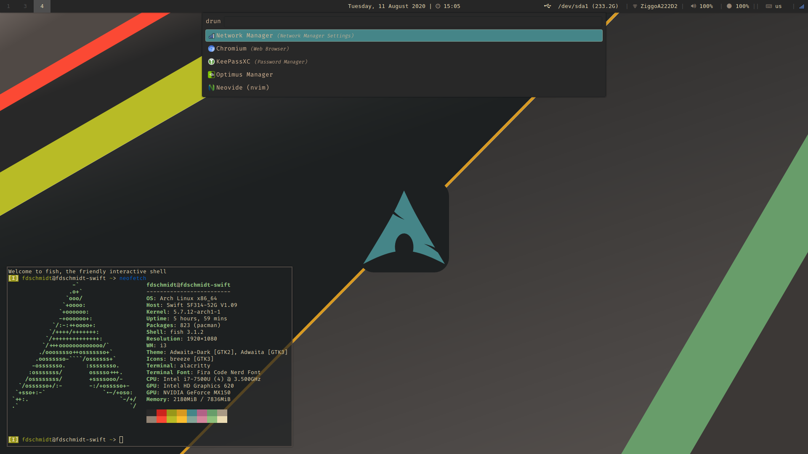
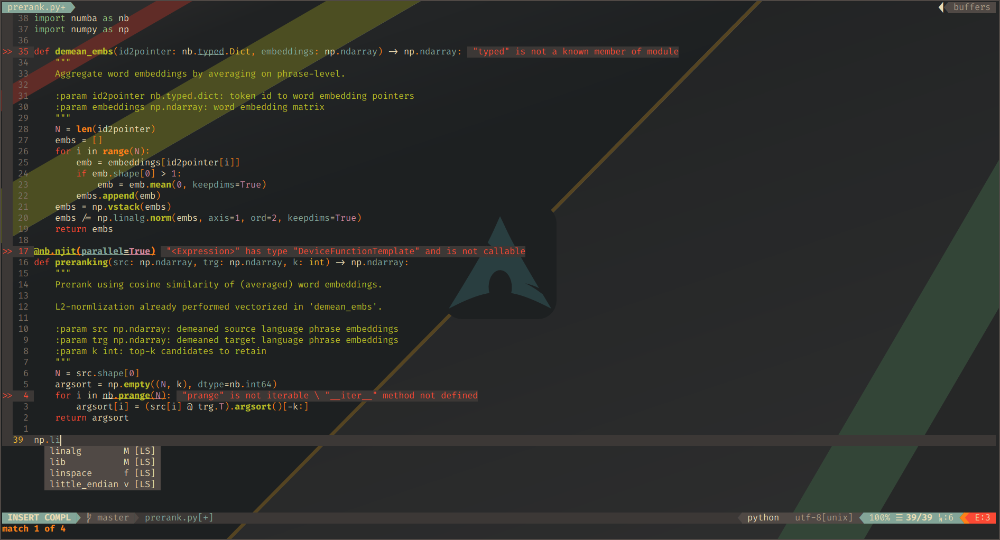
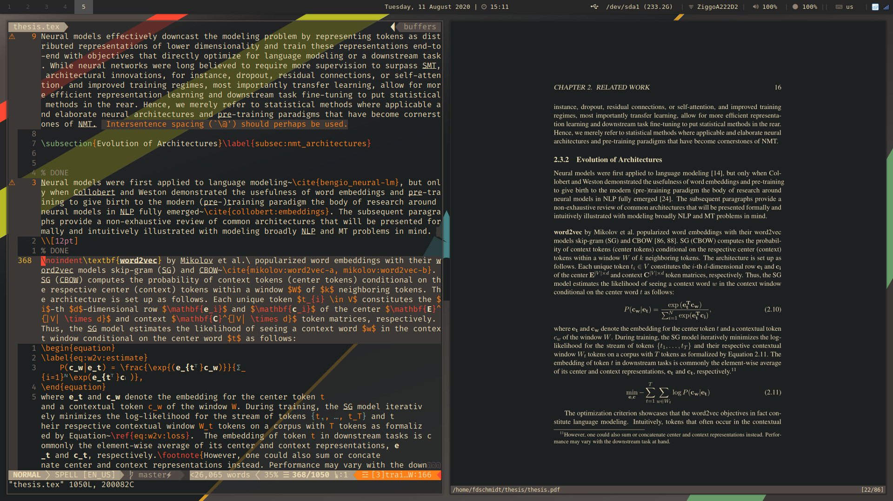

# Dotfiles

My dotfiles are synchronized with stow. To link a single configuration or the entire dotfiles to your local config folder, do ``stow --adopt $FOLDER`` or ``stow --adopt *``, respectively.

## Notable packages:
* **OS:** Arch Linux
* **Tiling Window Manager:** i3-gaps
* **Editor:** Neovim
* **Terminal Emulator:** Alacritty-ligatures
* **Shell** fish
* **Colorscheme:** Gruvbox
* **Compositor:** Picom

## Sample Screenshots

### Home Screen

### Neovim 

### Latex Setup

