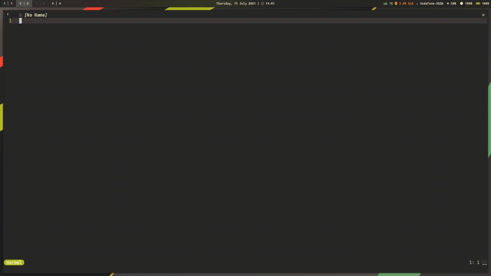

# Dotfiles
My dotfiles are synchronized with stow. To link a single configuration or the entire dotfiles to your local config folder, do stow --adopt $FOLDER or stow --adopt *, respectively.

## Packages

| Type                  | Name                     |
|-----------------------|--------------------------|
| OS                    | Arch Linux               |
| Colorscheme           | Gruvbox                  |
| Terminal Emulator     | Kitty                    |
| Editor                | Neovim                   |
| Shell                 | fish                     |
| Compositor            | Picom                    |
| Status Bar            | Polybar                  |
| Tiling Window Manager | i3-gaps                  |
| Font                  | JetBrains Mono Nerd Font |
| Application Launcher  | Rofi                     |

## Neovim

A show-case of my configuration from my work on [telescope-hop.nvim](https://github.com/nvim-telescope/telescope-hop.nvim).

| Plugins                                                               | Description                        |
|-----------------------------------------------------------------------|------------------------------------|
| [telescope.nvim](https://github.com/nvim-telescope/telescope.nvim)    | Fuzzy finder                       |
| [nvim-treesitter](https://github.com/nvim-treesitter/nvim-treesitter) | Syntax highlighting & text objects |
| [neogit](https://github.com/TimUntersberger/neogit)                   | A little magit for neovim          |
| [vim-slime](https://github.com/jpalardy/vim-slime)                    | REPL                               |
| [galaxyline.nvim](https://github.com/glepnir/galaxyline.nvim)         | Statusline                         |
| [nvim-lspconfig](https://github.com/neovim/nvim-lspconfig)            | Built-in LSP                       |

# TODO

- [ ] Commenting neovim config
- [ ] Screenshots
